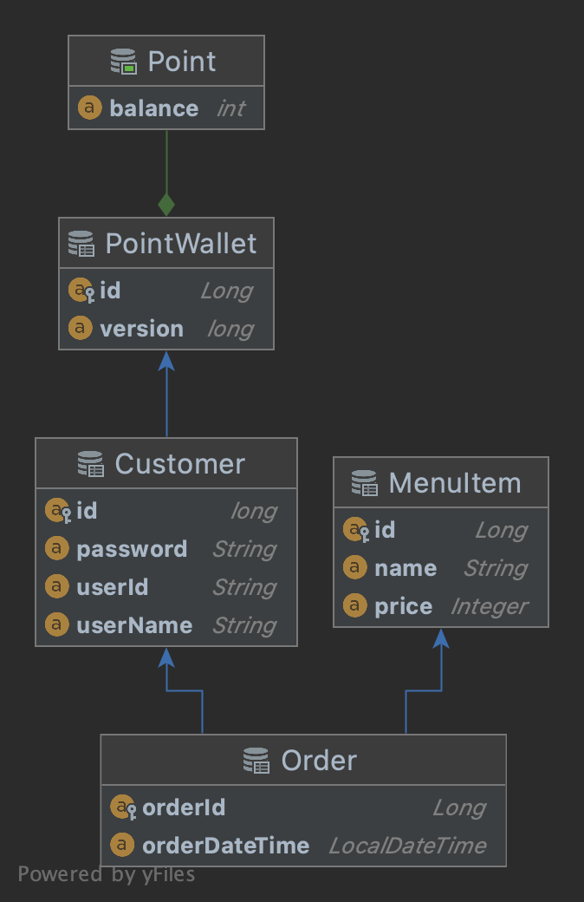
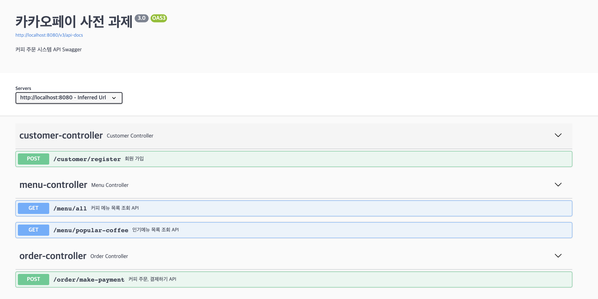
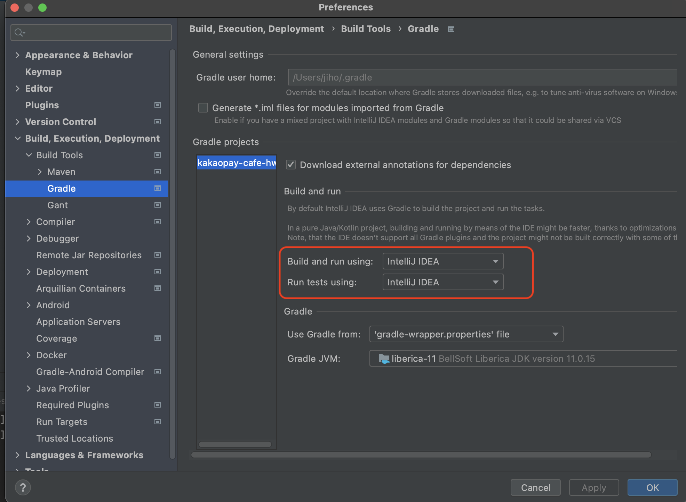

# 카카오페이 사전 과제 - 커피 주문 시스템

## 목차

- [개발 환경](#개발-환경)
- [빌드 및 실행 방법](#빌드-및-실행-방법)
- [기능 요구 사항](#기능-요구-사항)
- [기술 제약 사항](#기술-제약-사항)
- [엔티티 다이어그램](#엔티티-다이어그램)
- [구현 내용과 해결 전략](#구현-내용과-해결-전략)
- [기타](#기타)
- [체크 리스트](#체크-리스트)

## 개발 환경

- 기본 환경
    - IDE : IntelliJ IDEA Ultimate Ver.
    - OS :  macOS
    - GIT
- Application
    - JAVA 11
    - Spring boot 2.7.0
    - JPA + QueryDSL
    - H2
    - Gradle
    - Junit5

## 빌드 및 실행 방법

### 터미널 환경

- java, git 은 설치 되어 있어야 한다.

```bash
$ git clone https://github.com/Black-knight-P/k-cafe-hw.git
$ cd k-cafe-hw
$ ./gradlew clean build
$ java -jar build/libs/kakaopay-cafe-hw-0.0.1-SNAPSHOT.jar
```

- 접속 Base URI: `http://localhost:8080`

## 기능 요구 사항

- 개발 API 목록
    1. `커피 메뉴 목록 조회 API`
    2. `포인트 충전 하기 API`
    3. `커피 주문, 결제하기 API`
    4. `인기메뉴 목록 조회 API`
- 작성하신 어플리케이션이 다수의 서버에 다수의 인스턴스로 동작하더라도 기능에 문제가 없도록
  설계되어야 합니다.
- 각 기능 및 제약사항에 대한 단위테스트를 반드시 작성합니다.
- 동시성 이슈를 고려하여 구현합니다.
- 데이터 일관성을 고려하여 구현합니다.

## 기술 제약 사항

- 개발 언어는 Java, Kotlin 중 익숙한 개발 언어를 선택하여 과제를 진행해주시면 됩니다.
- 설계 내용과 설계의 이유, 핵심 문제해결 전략 및 분석한 내용을 작성하여 "readme.md" 파일을 작성합니다.
- 데이터 베이스 제약은 없습니다.
- API 의 HTTP Method들 (GET | POST | PUT | DEL) 은 자유롭게 선택하세요.
- 에러응답, 에러코드는 자유롭게 정의해주세요.

## 엔티티 다이어그램

- Entity를 비교적 심플하게 구성하였다.



- Customer (구매고객)
    - 구매고객 Entity
    - id (PK), userId(unique), userName, password, point_wallet_id(FK)
- PointWallet (포인트지갑)
    - 구매고객과 1:1 Mapping
    - id (PK), balance(잔액)
- MenuItem (메뉴 상품)
    - Cafe에서 판매중인 상품
    - id (PK), name, price
- Order (주문)
    - 구매고객이 주문한 내역
    - orderId (PK), orderDateTime, customerId(FK), menuItemId(FK)

## 구현 내용과 해결 전략

- 동시성 이슈와 데이터 일관성의 처리를 위해 고객 포인트의 충전과 차감 거래시, Transaction 격리 수준을 고려하여 구현하였다.
- 주문 내역에 대한 외부 수집서버 실시간 전송에 대해서 이벤트 기반 비동기 처리로 구현하였다.

### 1. 커피 메뉴 목록 조회 API

- Request

```bash
http://localhost:8080/menu/all
```

```bash
GET /menu/all HTTP/1.1
```

- Response

```json
[
    {
        "id": 1,
        "name": "아메리카노",
        "price": 3500
    },
    {
        "id": 2,
        "name": "카페라떼",
        "price": 4000
    },
    {
        "id": 3,
        "name": "카페모카",
        "price": 4500
    },
    {
        "id": 4,
        "name": "카푸치노",
        "price": 4600
    },
    {
        "id": 5,
        "name": "바닐라라떼",
        "price": 5100
    }
]
```

- `MenuItem` Entity findAll()로 개발 하였다.

```java
@RequiredArgsConstructor
@Transactional(readOnly = true)
@Service
public class MenuService {
    private final MenuItemRepository menuItemRepositor
    private final MenuCustomQueryRepository menuCustom
  
    /***
     * 판매중인 메뉴 전체를 조회한다.
     * @return List<MenuItem>
     */
    public List<MenuItem> getAllMenus() {
        return menuItemRepository.findAll();
    }

	...
}
```

### 2. 포인트 충전하기 API

- Request

```
http://localhost:8080/point/charge
```

```bash
POST /point/charge HTTP/1.1 
```

```json
{
	"userId" : "jiho", 
	"points" : 100000
}
```

- Response

```json
{
    "message": "COMPLETE",
    "status": 200
}
```

- 동시성 이슈와 데이터의 일관성을 처리 하기 위해, 충전시에는 Transaction의 isolation을 `REPEATABLE_READ` 로 설정하였다.

```java
@Transactional(isolation = Isolation.REPEATABLE_READ)
public void charge(String userId, Integer points) throws Exception {
    Customer customer = findCustomerByUserId(userId);
    customer.chargePoints(points);
}
```

### 3. 커피 주문, 결제하기 API

- Request

```
http://localhost:8080/order/make
```

```
POST /order/make HTTP/1.1
```

```json
{
    "userId": "jiho",
    "menuItemId": 1
}
```

- Response (정상)

```json
{
    "message": "COMPLETE",
    "status": 200
}
```

- Response (실패, 잔액부족, 회원 정보 아이템 정보 없음)

```json
{
    "message": "포인트 잔액부족으로 결제에 실패했습니다.",
    "code": "E1001",
    "status": 403
}
```
```json
{
    "message": "해당 회원이 존재하지 않습니다.",
    "code": "E0001",
    "status": 404
}
```
```json
{
    "message": "해당 메뉴는 존재하지 않습니다.",
    "code": "E2001",
    "status": 404
}
```

- Response (오류, Request Field 검증 오류)

```json
{
    "userId": "비어 있을 수 없습니다",
    "status": 404
}
```

- 동시성 이슈와 데이터의 일관성을 처리 하기 위해, 포인트 차감시에는 Transaction의 isolation을 `REPEATABLE_READ` 로 설정하였다.
- 정상 주문 건에 대한 수집 서버 전송을 위해 `Event 기반`으로 `비동기` 처리하였다.
    - 수집서버 전송이 주문 및 결제 거래 Transaction에 영향이 없도록 구현하였다.
    - 수집서버 전송 에러시, 구매 이력을 파일로 남겨 후행 처리가 가능 하도록 구현하였다.
  

- 주문 처리 Service Code
```java
@Slf4j
@RequiredArgsConstructor
@Transactional(readOnly = true)
@Service
public class OrderService {

  private final CustomerService customerService;
  private final PointService pointService;
  private final MenuService menuService;

  private final OrderRepository orderRepository;

  private final ApplicationEventPublisher applicationEventPublisher;

  @Transactional(isolation = Isolation.REPEATABLE_READ)
  public Order makeOrderProcess(String userId, Long menuId) throws Exception {
    Customer customer = customerService.findByUserId(userId);
    MenuItem orderedMenu = menuService.findByMenuId(menuId);
    Order order = Order.builder()
            .customer(customer)
            .menuItem(orderedMenu)
            .build();

    // 포인트 차감 처리
    pointService.deduct(userId, order.cost());
    Order completedOrder = orderRepository.save(order);

    log.debug("Make Order Process COMPLETE : {}", completedOrder);

    // 수집 플랫폼 서버 전송 비동기 이벤트 처리
    applicationEventPublisher.publishEvent(OrderHistoryDto.builder()
            .userId(userId)
            .price(order.cost())
            .menuName(orderedMenu.getName())
            .build());

    return completedOrder;
  }
}
```
- 비동기 이벤트 처리 리스너
```java
@Slf4j
@RequiredArgsConstructor
@Component
public class OrderEventHandler {

    private final MessageService messageService;

    /**
     * 집계서버 전송을 위한 비동기 Event Listener
     * @param history
     */
    @Async
    @TransactionalEventListener(phase = TransactionPhase.AFTER_COMMIT, classes = OrderHistoryDto.class)
    public void orderCompleteEventListener(OrderHistoryDto history) {
        try {
            log.debug("SEND Collection Server Event Listen : {}", history);
            messageService.sendCollectionServer(history);
        } catch (Exception e) { // 전송 실패시, Deferred File 처리. (실패건 후행 처리 목적)
            log.error("Collection Server Send Fail!, Write Deferred File ");
            e.printStackTrace();
            messageService.writeDeferredFile(history);
        }
    }
}
```

### 4. 인기 메뉴 목록 조회 API

- Request

```
http://localhost:8080/menu/popular-coffee
```
```
GET /menu/popular-coffee HTTP/1.1
```

- Response

```json
[
    {
        "menuItemId": 2,
        "menuName": "카페라떼",
        "saleCount": 19
    },
    {
        "menuItemId": 3,
        "menuName": "카페모카",
        "saleCount": 18
    },
    {
        "menuItemId": 1,
        "menuName": "아메리카노",
        "saleCount": 10
    }
]
```

- 주문 집계을 통한 인기 상품 추출은 QueryDSL로 해결하였다.
    - 개별 커피의 판매 내역 정확한 카운트가 필요 했고, 그중 Top 3의 MenuItem을 리턴하도록 구현하였다.
    - Projections.fields 로 QueryDSL 결과를 DTO로 바로 Mapping 처리하였다.

```java
@RequiredArgsConstructor
@Repository
public class MenuCustomQueryRepository {

    private final JPAQueryFactory jpaQueryFactory;

    /**
     * 7일간 인기 상품 추출 Query
     * @return List<PopularMenuItemDto>
     */
    @Transactional
    public List<PopularMenuItemDto> getPopularMenus() {

        NumberPath<Long> count = Expressions.numberPath(Long.class, "saleCount");
        return jpaQueryFactory
                .select(Projections.fields(PopularMenuItemDto.class,
                        menuItem.id.as("menuItemId"),
                        menuItem.name.as("menuName"),
                        menuItem.count().as(count)))
                .from(order)
                .leftJoin(menuItem).on(order.menuItem.id.eq(menuItem.id))
                .where(order.orderDateTime.between(LocalDateTime.of(LocalDate.now().minusDays(7), LocalTime.MIN), LocalDateTime.of(LocalDate.now(), LocalTime.MAX)))
                .groupBy(menuItem.id)
                .orderBy(menuItem.count().desc())
                .limit(3L)
                .fetch();
    }
}
```

## 기타

### Swagger API 테스트 방법
- Spring Appication 구동 후, [Swagger](http://localhost:8080/swagger-ui/index.html) 접속 ([http://localhost:8080/swagger-ui/index.html](http://localhost:8080/swagger-ui/index.html))



### IntelliJ 테스트코드 실행 오류 발생시,
- Preferences → Build,Execution, Deployment → Build Tools → Gradle 설정 변경


## 체크 리스트

- [x]  다수의 서버에 다수의 인스턴스로 동작하더라도 기능에 문제가 없는가
- [x]  각 기능 및 제약사항에 대한 단위테스트를 반드시 작성이 되어 있는가
- [x]  동시성 이슈를 고려하여 구현 하였는가
- [x]  데이터 일관성을 고려하여 구현 하였는가